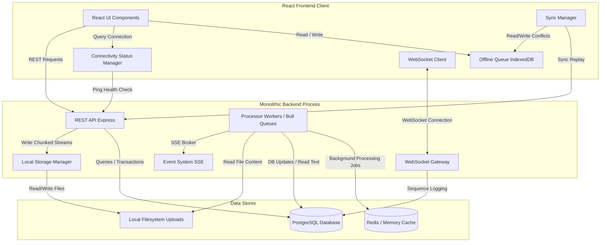
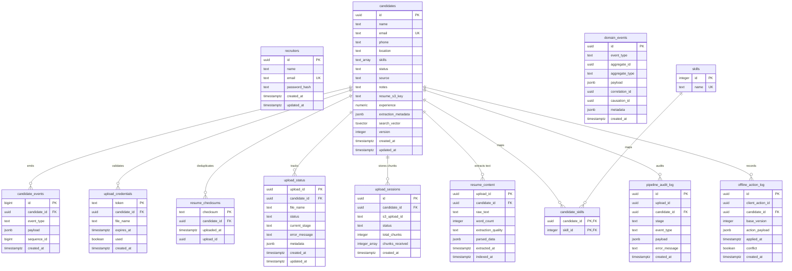
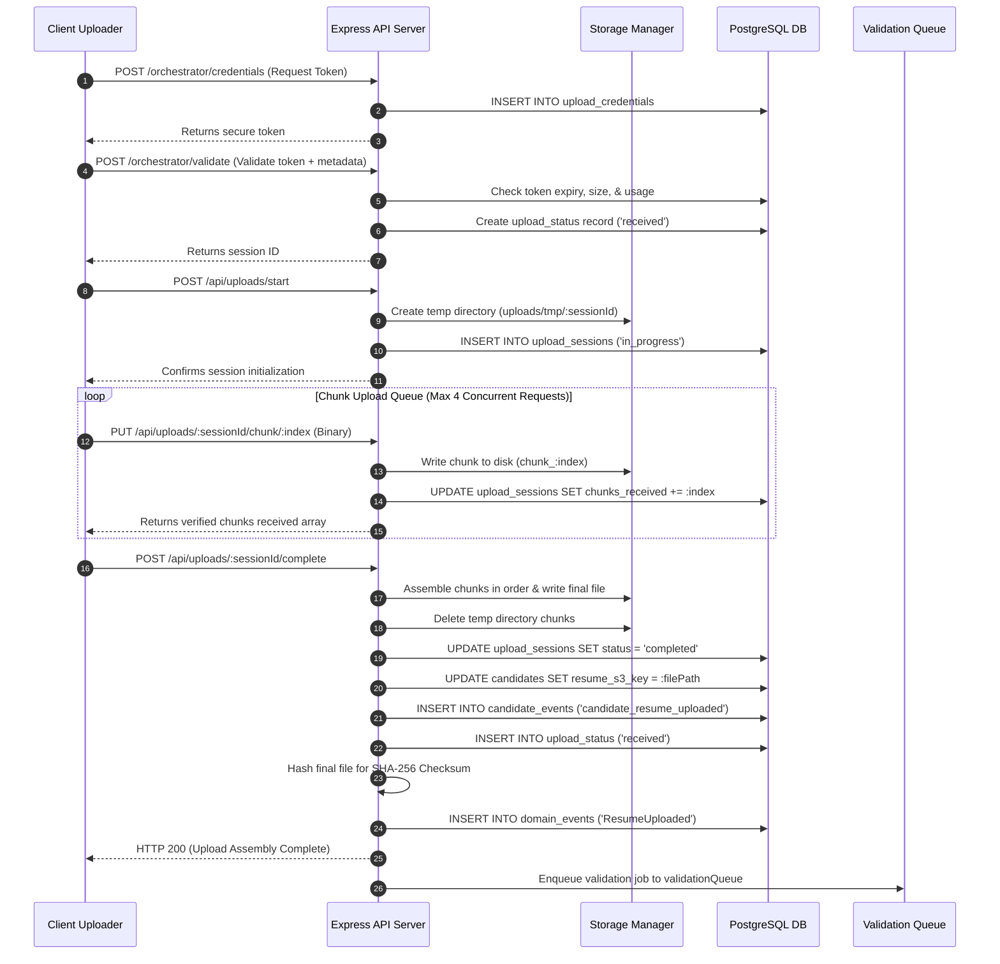
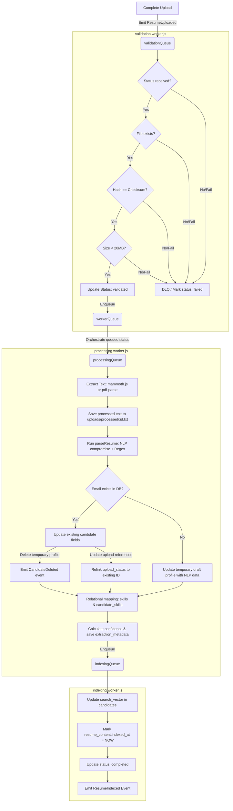
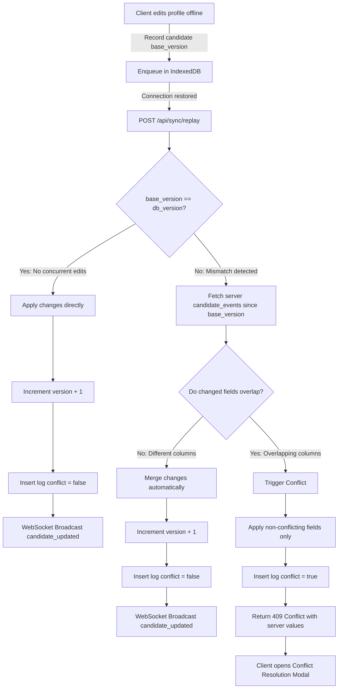

# System Architecture & Design Document (HLD/LLD)
## Recruiter Workspace

This document provides a comprehensive High-Level Design (HLD) and Low-Level Design (LLD) overview of the **Recruiter Workspace**, a high-performance system for candidate management, resume parsing, and multi-user synchronization.

---

## 1. System Objectives & Architecture Goals
The Recruiter Workspace is designed to handle high recruiter throughput and massive candidate pools (up to 100,000 candidate profiles). The core architecture targets:
* **Real-time Synchronization**: Instant updates across active users for candidate profile edits, pipeline statuses, and upload progress.
* **Resilient Async Parsing**: Robust validation and background text extraction/NLP parsing for bulk resume uploads.
* **Offline Functionality**: Staging of edits on the client when connection drops, resolved via a field-level conflict reconciliation engine on reconnect.
* **Search Performance**: Instant prefix searches and rank-ordered search calculations leveraging PostgreSQL full-text search indices.

---

## 2. High-Level Design (HLD)

### 2.1 System Architecture Map
The application follows a single-page frontend (React) and a monolithic backend process running on Node.js (combining HTTP REST APIs, SSE endpoints, WebSockets, and process queue workers) backed by a PostgreSQL database and an optional Redis cache.



### 2.2 Component Details

#### Frontend (React Client)
* **UI Subsystem**: Virtualized list implementation ([CandidateList.jsx](file:///r:/Novelski/Workspace/Recruiter Workspace (2)/Recruiter Workspace/Recruiter Workspace/client/src/components/CandidateList.jsx)) utilizing a fixed `56px` row height to support smooth scrolling across 100,000 candidate records. React `useReducer` handles selection, scrolling, and list state with zero bundle bloat.
* **Offline Queue**: A transactional browser store ([offlineQueue.js](file:///r:/Novelski/Workspace/Recruiter Workspace (2)/Recruiter Workspace/Recruiter Workspace/client/src/utils/offlineQueue.js)) built on IndexedDB to queue mutations offline and store detailed server-side conflicts.
* **Connectivity Status Manager**: Monitors browser networking state, blending periodic REST `/health` checks and WebSocket ping-pong heartbeats to determine true connection status.
* **WebSocket Client**: A connection wrapper ([webSocketClient.js](file:///r:/Novelski/Workspace/Recruiter Workspace (2)/Recruiter Workspace/Recruiter Workspace/client/src/utils/webSocketClient.js)) that handles reconnections using exponential backoff, drops echoed events generated by the self-same client, and buffers incoming events into 50ms batches to prevent out-of-order rendering.
* **Sync Manager**: Binds to connection recovery, replaying IndexedDB actions via `/api/sync/replay` ([syncManager.js](file:///r:/Novelski/Workspace/Recruiter Workspace (2)/Recruiter Workspace/Recruiter Workspace/client/src/utils/syncManager.js)). It applies merged profiles and manages user conflicts using side-by-side comparative views ([ConflictResolutionModal.jsx](file:///r:/Novelski/Workspace/Recruiter Workspace (2)/Recruiter Workspace/Recruiter Workspace/client/src/components/ConflictResolutionModal.jsx)).

#### Backend Server (Express, WebSockets & Bull Queues)
* **REST API**: Serves JSON endpoints for candidate profile CRUD actions, full-text search queries, keyset cursor coordinates, chunk upload session configurations, and offline action replay processing.
* **WebSocket Gateway**: Maps connection states, handles authentication via JWT tokens, broadcasts updates, and writes audit trails to the database ([websocket.js](file:///r:/Novelski/Workspace/Recruiter Workspace (2)/Recruiter Workspace/Recruiter Workspace/server/src/websocket.js)).
* **Local Storage Manager**: Handles partial binary streams, concatenates chunks sequentially, sanitizes target paths, and manages directories on disk ([storage.js](file:///r:/Novelski/Workspace/Recruiter Workspace (2)/Recruiter Workspace/Recruiter Workspace/server/src/storage.js)).
* **Event System (SSE)**: Streams pipeline events (e.g. text extracted, indexed, failed) to UI components via Server-Sent Events ([eventSystem.js](file:///r:/Novelski/Workspace/Recruiter Workspace (2)/Recruiter Workspace/Recruiter Workspace/server/src/pipeline/eventSystem.js)).
* **Processor Workers (Bull)**: Organizes async jobs via structured workers ([processor.js](file:///r:/Novelski/Workspace/Recruiter Workspace (2)/Recruiter Workspace/Recruiter Workspace/server/src/pipeline/processor.js)). Utilizes Redis (or an in-memory database mock `ioredis-mock` when configured with `REDIS_URL=mock` for testing/isolation) to execute validation, extraction, indexing, and error handling.

### 2.3 Technology Stack
| Layer | Technology | Rationale |
|---|---|---|
| **Frontend** | React, Vite | Rapid build tooling and component-level reactive states. |
| **Styling** | Vanilla CSS (HSL variables) | Curated CSS tokens and lightweight custom micro-animations (e.g., violet highlight pulses). |
| **Backend API** | Node.js, Express | Dynamic request handling and native streaming capabilities. |
| **Async Queues** | Bull (Redis-backed) | High-throughput Redis job queues supporting task retries and backoff strategies. |
| **Search Engine** | PostgreSQL Full-Text Search | Native FTS query capabilities, removing the need for a separate Elasticsearch instance. |
| **NLP Engine** | Compromise.js, Natural | Lightweight NLP-based parsing and tokenization running directly in Node.js. |
| **File Formats** | mammoth.js, pdf-parse | Low-dependency text extraction from Microsoft Word (`.docx`) and PDF documents. |
| **Containerization**| Docker Compose, Nginx | Standardized local network proxies, database configurations, and environment setups. |

---

## 3. Low-Level Design (LLD)

### 3.1 Detailed Database Schema
The database runs on PostgreSQL. Below is the detailed schema showing tables, indexes, triggers, and relational schemas.



#### Index & Trigger Optimizations
To support rapid filtering and text searches, the following database configurations are executed in [migrations](file:///r:/Novelski/Workspace/Recruiter Workspace (2)/Recruiter Workspace/Recruiter Workspace/server/migrations):
1. **Full-Text GIN Index**:
   ```sql
   CREATE INDEX IF NOT EXISTS idx_candidates_search_vector ON candidates USING gin(search_vector);
   ```
2. **Partial Status Index**:
   ```sql
   CREATE INDEX IF NOT EXISTS idx_candidates_status_partial ON candidates(status) WHERE status != 'Rejected';
   ```
3. **Composite Filters Index**:
   ```sql
   CREATE INDEX IF NOT EXISTS idx_candidates_location_status ON candidates(location, status);
   CREATE INDEX IF NOT EXISTS idx_candidates_status_updated_at ON candidates(status, updated_at);
   ```
4. **Skills GIN Index**:
   ```sql
   CREATE INDEX IF NOT EXISTS idx_candidates_skills_gin ON candidates USING gin(skills);
   ```
5. **Search Vector Trigger Function**:
   Autaggregates candidate fields alongside the extracted resume text in [012_update_candidates_trigger.sql](file:///r:/Novelski/Workspace/Recruiter Workspace (2)/Recruiter Workspace/Recruiter Workspace/server/migrations/012_update_candidates_trigger.sql):
   ```sql
   CREATE OR REPLACE FUNCTION candidates_search_vector_trigger()
   RETURNS trigger AS $$
   DECLARE
       resume_text TEXT := '';
   BEGIN
       IF TG_OP = 'UPDATE' AND NEW.search_vector IS DISTINCT FROM OLD.search_vector THEN
           RETURN NEW;
       END IF;
       SELECT string_agg(raw_text, ' ') INTO resume_text FROM resume_content WHERE candidate_id = NEW.id;
       NEW.search_vector :=
           to_tsvector('simple', coalesce(NEW.name, '')) ||
           to_tsvector('simple', coalesce(NEW.email, '')) ||
           to_tsvector('simple', coalesce(array_to_string(NEW.skills, ' '), '')) ||
           to_tsvector('english', coalesce(resume_text, ''));
       RETURN NEW;
   END;
   $$ LANGUAGE plpgsql;
   ```

---

### 3.2 Resumable Chunked Upload & Assembly Flow
Resumable uploads are orchestrated as a secure multi-phase state machine between [resumableUpload.js](file:///r:/Novelski/Workspace/Recruiter Workspace (2)/Recruiter Workspace/Recruiter Workspace/client/src/utils/resumableUpload.js) and the server's upload endpoints:



---

### 3.3 Async Parsing & Candidate Merging Pipeline
Once the `ResumeUploaded` event is written, the background pipeline starts processing the resume through Bull queues, NLP models, and database merge strategies:



#### NLP Extraction Rules (`resumeParser.js`)
The `parseResume()` function in [resumeParser.js](file:///r:/Novelski/Workspace/Recruiter Workspace (2)/Recruiter Workspace/Recruiter Workspace/server/src/pipeline/resumeParser.js) processes raw resume text using NLP entity extraction and targeted regular expressions:
* **Name Extraction**: Compromise `nlp.people()` parses the first 200 characters. Heuristic backup scans the top 5 lines, discarding emails, numbers, URLs, and all-caps headings.
* **Email & Phone**: Extracted via global patterns. The email regex ignores placeholders (e.g. `example.com`), and phone regex filters US/international configurations.
* **Experience Calculation**:
  1. *Direct Statements*: Regular expressions search for patterns like `(\d+)\+?\s*years?\s*of\s*experience`.
  2. *Date Spans*: Extracts years (e.g. `2018 - 2022`) and calculates duration relative to the current year.
  3. *Heuristics*: Counts occurrences of roles (e.g. *Senior Developer*, *Engineering Lead*) and estimates duration ($2 \text{ years} \times \text{role count}$).
* **Skills Relational Mapping**: Checks the raw text for matches against a predefined dictionary of 80+ programming languages, frameworks, and developer tools. Matches are relationally inserted into the `skills` table (to prevent duplication) and joined to the candidate via `candidate_skills`.

---

### 3.4 Collaborative Sync & Concurrency Control
Collaborative edits utilize **Optimistic Concurrency Control (OCC)** to prevent users from overriding each other's changes.



#### Message Echo Mitigation & Reordering
To ensure smooth performance during simultaneous updates:
* **Echo Suppression**: WebSocket broadcasts include the originating client's ID as `_originClientId`. The originating client checks this header and drops the event, preventing double-renders and UI flicker.
* **Batch Sorting**: The client buffers WebSocket messages in a 50ms window. Before rendering, it sorts the buffered events by `sequence_id` to guarantee they are processed in order.
* **Event Catch-up**: Upon WebSocket reconnection, the client requests all events since its last processed sequence ID via `GET /api/events/since/:sequenceId`, processing missed events before resuming the live stream.

---

### 3.5 Full-Text Search Service & Caching
The Search Service ([search.js](file:///r:/Novelski/Workspace/Recruiter Workspace (2)/Recruiter Workspace/Recruiter Workspace/server/src/pipeline/search.js)) leverages native PostgreSQL index capabilities to serve queries:
1. **Tokenization**: Cleans the search input and maps words to a prefix `tsquery` string (e.g. `John & dev:*`).
2. **Text Highlighting**: Employs PostgreSQL `ts_headline` to extract a 30-word snippet from the resume text containing the query matches.
3. **Pagination**: Implements keyset pagination using a base64 encoded cursor containing the boundary columns:
   * *Search*: Coordinates are `{ searchRank, updatedAt, id }`.
   * *Browse*: Coordinates are `{ updatedAt, id }`.
4. **Caching**: Results are stored in an in-memory **LRU Query Cache** (default capacity: 500 queries, TTL: 30 seconds). Cache statistics (hits, misses, hit ratio) and query times are recorded dynamically.

---

## 4. Operational Monitoring & Metrics
The backend exposes specific endpoints for health checks, performance monitoring, and queue auditing:
* **API Health Check**: `GET /health` returns `{ status: "ok" }`.
* **Search Performance Metrics**: `GET /search/metrics` provides query statistics:
  ```json
  {
    "total_queries": 154,
    "avg_query_duration_ms": 12.5,
    "p95_query_duration_ms": 45.0,
    "p99_query_duration_ms": 120.0,
    "cache_hit_rate": 42.5,
    "queries_per_minute": 24,
    "slow_queries": 2
  }
  ```
* **Event Stream Status**: `GET /events/stream/stats` returns the number of active SSE subscribers and event emission frequency.
* **Upload Audit Logs**: `GET /orchestrator/audit/:uploadId` exposes the complete parsing history for a resume upload.
