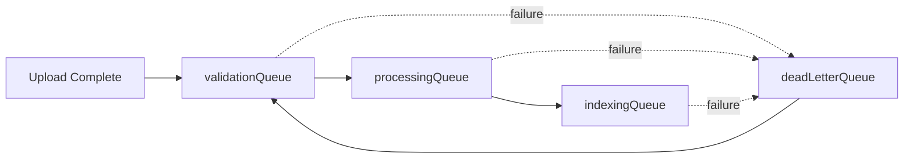

# Architecture Document
## Recruiter Workspace

**Version:** 1.0  
**Date:** August 5, 2026  

---

## 1. System Overview

Recruiter Workspace is architected as a **React Single-Page Application (SPA)** communicating with a **monolithic Node.js backend** that combines REST APIs, WebSocket gateway, SSE event streams, and Bull queue workers in a single process, backed by **PostgreSQL** (primary data store and full-text search engine) and **Redis** (job queue backing store, optional).

### High-Level Architecture Diagram

```
┌──────────────────────────────────┐     ┌───────────────────────────────────────────────┐
│      React Client (Vite SPA)     │     │          Node.js Backend (Express 5)          │
│                                  │     │                                               │
│  ┌─────────────────────────────┐ │     │  ┌────────────┐  ┌────────────────────────┐   │
│  │ Virtualized Candidate List  │ │REST │  │  REST API  │  │  Pipeline Workers      │   │
│  │ + Detail Panel + Filter Bar │◄├────►│  │  (CRUD,    │  │  ┌──────────────────┐  │   │
│  └─────────────────────────────┘ │     │  │   Search,  │  │  │ Validation       │  │   │
│  ┌─────────────────────────────┐ │     │  │   Sync)    │  │  │ Processing/NLP   │  │   │
│  │ Offline Queue (IndexedDB)   │ │ WS  │  └────────────┘  │  │ Indexing         │  │   │
│  │ + Sync Manager              │◄├────►│  ┌────────────┐  │  │ Dead-Letter      │  │   │
│  └─────────────────────────────┘ │     │  │ WebSocket  │  │  └──────────────────┘  │   │
│  ┌─────────────────────────────┐ │     │  │ Gateway    │  └────────────────────────┘   │
│  │ Connectivity Monitor        │ │ SSE │  └────────────┘  ┌────────────────────────┐   │
│  │ + Conflict Resolution       │◄├────►│  ┌────────────┐  │  Storage Manager       │   │
│  └─────────────────────────────┘ │     │  │ SSE Broker │  │  (Chunked Uploads)     │   │
│  ┌─────────────────────────────┐ │     │  └────────────┘  └────────────────────────┘   │
│  │ Upload Client (Resumable)   │ │     └──────────┬─────────────────┬─────────────────┘
│  └─────────────────────────────┘ │                │                 │
└──────────────────────────────────┘                ▼                 ▼
                                         ┌──────────────┐   ┌────────────────┐
                                         │ PostgreSQL   │   │ Redis          │
                                         │ 16 (FTS,     │   │ 7 (Bull Queues)│
                                         │ GIN indexes) │   │                │
                                         └──────────────┘   └────────────────┘
```

### Communication Protocols

| Protocol | Direction | Purpose |
|----------|-----------|---------|
| **REST/HTTP** | Client ↔ Server | CRUD operations, search queries, file uploads, sync replay |
| **WebSocket** | Client ↔ Server (bidirectional) | Real-time event broadcast, heartbeat ping/pong, auth handshake |
| **SSE** | Server → Client (unidirectional) | Pipeline progress streaming (upload status events) |

---

## 2. Tech Stack & Justification

| Layer | Technology | Version | Justification |
|-------|------------|---------|---------------|
| **Frontend Framework** | React | 19 | Component-based SPA with fine-grained reactivity. `useReducer` used for complex list state without external state libraries. |
| **Build Tool** | Vite | 8 | Sub-second HMR for rapid development; ES module native bundling. |
| **Styling** | Vanilla CSS (HSL custom properties) | — | Zero framework overhead; full control over dark/light theming and micro-animations. No dependency on Tailwind/Bootstrap. |
| **Icons** | Lucide React | 1.23 | Lightweight tree-shakeable SVG icons (vs. heavier alternatives like Font Awesome). |
| **Client Routing** | React Router DOM | 7 | Mature client-side routing with nested routes and protected route wrappers. |
| **Backend Runtime** | Node.js | 18+ | Native async I/O, streaming support, and unified JavaScript across stack. |
| **HTTP Framework** | Express | 5 | Minimal, well-understood REST framework with middleware ecosystem. |
| **Real-Time** | `ws` (WebSocket) | 8.21 | Low-latency bidirectional communication. Raw `ws` chosen over Socket.IO for smaller footprint and full protocol control. |
| **Database** | PostgreSQL | 16 | Full-text search via GIN-indexed `tsvector` eliminates the need for Elasticsearch. ACID transactions, JSONB support, UUID generation. |
| **Job Queue** | Bull (Redis-backed) | 4.16 | Reliable async job processing with retries, exponential backoff, and dead-letter queues. `ioredis-mock` for Redis-free development. |
| **NLP/Extraction** | Compromise.js + Natural | 14/8 | Lightweight NLP running in-process (no external API calls, no latency). Compromise for named entity recognition; Natural for tokenization. |
| **File Parsing** | Mammoth.js + pdf-parse | 1.8/1.1 | Zero-dependency DOCX→text and PDF→text extraction running locally. |
| **Authentication** | JWT + bcrypt | 9.0/6.0 | Stateless token-based auth. Bcrypt with 10 salt rounds for password hashing. |
| **Logging** | Pino | 9.2 | Structured JSON logging; 5× faster than Winston. Configurable log levels via `LOG_LEVEL`. |
| **Containerization** | Docker Compose + Nginx | — | Multi-service orchestration with Nginx reverse proxy for path-based routing to microservices. |

---

## 3. Component Breakdown

### 3.1 Frontend (React SPA)

```
client/src/
├── App.jsx                    ← Root: routing, auth state, theme, sidebar nav
├── main.jsx                   ← Vite entry point
├── index.css                  ← Global CSS custom properties & theme tokens
├── App.css                    ← Application layout & component styles
├── apiClient.js               ← Fetch wrapper with JWT Authorization header
├── auth.js                    ← Token storage (localStorage), getCurrentUser()
├── config.js                  ← VITE_API_URL and environment config
│
├── components/
│   ├── AuthPages.jsx          ← Login & Registration forms
│   ├── CandidateList.jsx      ← Virtualized table (100K+ rows, 56px row height)
│   ├── CandidateDetailPanel.jsx ← Slide-out profile editor with inline save
│   ├── AddCandidateForm.jsx   ← Modal form for creating new candidates
│   ├── ConflictResolutionModal.jsx ← Side-by-side field-level merge UI
│   ├── FilterBar.jsx          ← Status/location/skills/resume filters
│   ├── SearchPage.jsx         ← Full-text search interface with result cards
│   ├── MetricsDashboardPage.jsx ← Charts for search perf, uploads, storage
│   ├── ProfilePage.jsx        ← Candidate profile detail view
│   ├── SettingsPage.jsx       ← Application settings UI
│   ├── UploadPanel.jsx        ← Drag-and-drop resume upload with chunking
│   ├── UploadStatusTracker.jsx ← SSE-driven real-time pipeline progress
│   ├── ConnectionStatus.jsx   ← Connectivity indicator (online/offline/reconnecting)
│   ├── ResumeModal.jsx        ← In-browser resume preview (HTML/PDF/text)
│   ├── ShaderBackground.jsx   ← WebGL animated background
│   ├── ToastContainer.jsx     ← Toast notification system
│   ├── PanelRight.jsx         ← Right sidebar panel component
│   └── ProtectedRoute.jsx     ← Auth guard wrapper for routes
│
├── utils/
│   ├── webSocketClient.js     ← WS connection, auth, echo suppression, 50ms batching
│   ├── offlineQueue.js        ← IndexedDB mutation queue with conflict storage
│   ├── syncManager.js         ← Offline replay engine & conflict handling
│   ├── resumableUpload.js     ← Chunked upload client (4 concurrent, resumable)
│   ├── connectivityStatus.js  ← Network state detection (health + WS heartbeat)
│   └── toast.js               ← Toast notification helper
│
└── contexts/
    └── WebSocketContext.jsx   ← React context provider for WS client instance
```

**Key Architectural Decisions:**
- **No state management library** — `useState` + `useReducer` + Context API handles all state. The candidate list uses a reducer for selection, scroll position, and row data.
- **Virtualization** — Custom implementation with fixed 56px row height, calculating visible rows from scroll offset. No `react-window` or `react-virtualized` dependency.
- **Offline-first** — IndexedDB stores pending mutations with `base_version` snapshots. The sync manager replays them sequentially on reconnect.

---

### 3.2 Backend (Node.js Monolith)

```
server/src/
├── index.js          ← Express app: middleware, all REST routes, server boot
├── config.js         ← Environment variable loader (dotenv)
├── db.js             ← PostgreSQL connection pool (pg)
├── storage.js        ← File chunk assembly & disk management
├── websocket.js      ← WebSocket gateway (JWT auth, broadcast, event subscription)
├── events.js         ← Domain event helpers (emitDomainEvent)
│
├── pipeline/
│   ├── orchestrator.js    ← Upload lifecycle: token issuance, validation, audit
│   ├── processor.js       ← Bull worker bootstrap & event subscription
│   ├── queues.js          ← Bull queue definitions (validation, processing, indexing, DLQ)
│   ├── resumeParser.js    ← NLP entity extraction (Compromise + regex heuristics)
│   ├── search.js          ← FTS query builder, LRU cache, pagination, metrics
│   ├── eventSystem.js     ← SSE broker for pipeline events + in-process pub/sub
│   └── workers/
│       ├── validation.worker.js   ← File integrity checks (hash, size, format)
│       ├── processing.worker.js   ← Text extraction + NLP + DB merge
│       ├── indexing.worker.js     ← Search vector computation + index update
│       └── deadletter.worker.js   ← Failed job recovery & retry
│
└── __tests__/         ← Jest unit tests for routes, workers, utilities
```

**Key Architectural Decisions:**
- **Monolithic process** — All services (REST, WebSocket, SSE, Bull workers) run in a single Node.js process for development simplicity. Docker Compose splits them into separate containers for production.
- **In-process event bus** — The WebSocket gateway subscribes directly to the SSE event system's `activeSubscribers` set, receiving events with zero network latency.
- **Optimistic Concurrency Control** — Every candidate has a `version` integer. Updates require `expectedVersion` matching the current DB version; mismatches return `409 Conflict`.

---

### 3.3 Database (PostgreSQL 16)

The database contains **12 tables** organized into three domains:

#### Core Domain
| Table | Purpose |
|-------|---------|
| `candidates` | Primary candidate profiles (name, email, skills, status, search_vector, version) |
| `recruiters` | Recruiter accounts (name, email, password_hash) |
| `candidate_events` | Append-only event log for WebSocket sync (event_type, payload, sequence_id) |
| `domain_events` | Domain event store with correlation/causation IDs for tracing |

#### Upload & Processing Domain
| Table | Purpose |
|-------|---------|
| `upload_sessions` | Tracks chunked upload state (chunks_received array, status) |
| `upload_credentials` | Short-lived upload tokens with expiry and one-time-use flag |
| `upload_status` | Pipeline processing state machine (received → validated → processing → completed/failed) |
| `resume_checksums` | SHA-256 deduplication registry |
| `resume_content` | Extracted raw text, word count, quality score, parsed JSONB data |
| `pipeline_audit_log` | Complete audit trail of every pipeline stage execution |

#### Search & Sync Domain
| Table | Purpose |
|-------|---------|
| `skills` | Normalized skill dictionary (name, unique) |
| `candidate_skills` | Many-to-many join table between candidates and skills |
| `offline_action_log` | Records replayed offline actions with conflict status |

#### Indexes & Triggers
- **GIN index on `search_vector`** — Powers sub-50ms full-text search
- **GIN index on `skills` array** — Fast array containment queries
- **Composite indexes** — `(status, updated_at)`, `(location, status)` for filtered list queries
- **Partial index** — `status WHERE status != 'Rejected'` for active candidate filtering
- **Trigger function** — Automatically recomputes `search_vector` on INSERT/UPDATE, incorporating resume text from `resume_content`

---

### 3.4 Queue System (Bull + Redis)

Four named queues process resume uploads asynchronously:



| Queue | Worker | Responsibilities |
|-------|--------|-----------------|
| `validationQueue` | `validation.worker.js` | Check upload_status = received, verify file exists on disk, validate SHA-256 checksum, enforce 20MB size limit |
| `processingQueue` | `processing.worker.js` | Extract text (Mammoth for DOCX, pdf-parse for PDF), run NLP parser, merge/create candidate record, map skills relationally |
| `indexingQueue` | `indexing.worker.js` | Recompute `search_vector`, update `resume_content.indexed_at`, mark status = completed |
| `deadLetterQueue` | `deadletter.worker.js` | Re-enqueue failed jobs with backoff; log permanent failures |

**Redis mock mode:** Setting `REDIS_URL=mock` replaces Redis with `ioredis-mock` for development. Jobs are processed in-memory but are not persisted across restarts.

---

### 3.5 Third-Party Services / Integrations

| Service | Usage | Status |
|---------|-------|--------|
| **Redis** | Bull queue backing store | Required for production; optional with `mock` mode for dev |
| **AWS S3** | Resume file cloud storage | **Planned** — Schema supports `resume_s3_key`, env vars `AWS_REGION`/`S3_BUCKET_NAME` exist but storage is currently local filesystem |
| **OpenAI / Gemini / Anthropic** | LLM-augmented resume parsing | **Planned** — Not yet integrated |

> [!NOTE]
> The current implementation uses **zero external API calls** for resume parsing. All NLP processing runs locally via Compromise.js and Natural.

---

## 4. Data Flow

### 4.1 Resume Upload & Parse Flow

```
Client                          Server                        PostgreSQL           Bull/Redis
  │                               │                               │                    │
  │─── POST /orchestrator/credentials ──►│                        │                    │
  │                               │── INSERT upload_credentials ──►│                    │
  │◄── { token } ─────────────────│                               │                    │
  │                               │                               │                    │
  │─── POST /orchestrator/validate ────►│                          │                    │
  │                               │── Verify token, create upload_status ──►│           │
  │◄── { uploadId } ──────────────│                               │                    │
  │                               │                               │                    │
  │─── POST /api/uploads/start ───────►│                          │                    │
  │                               │── mkdir uploads/tmp/:sessionId │                    │
  │                               │── INSERT upload_sessions ─────►│                    │
  │◄── { sessionId } ─────────────│                               │                    │
  │                               │                               │                    │
  │─── PUT chunk/:index (×N) ─────────►│                          │                    │
  │                               │── Write chunk to disk          │                    │
  │                               │── UPDATE chunks_received ─────►│                    │
  │◄── { chunksReceived } ────────│                               │                    │
  │                               │                               │                    │
  │─── POST /complete ────────────────►│                          │                    │
  │                               │── Assemble chunks → final file │                    │
  │                               │── UPDATE candidate, sessions ──►│                   │
  │                               │── SHA-256 hash file            │                    │
  │                               │── emitDomainEvent('ResumeUploaded') ────────────────►│
  │◄── { filePath } ──────────────│                               │   (enqueue validation)
  │                               │                               │                    │
  │◄── SSE: stage=validating ─────│◄───── validation.worker ──────│◄───────────────────│
  │◄── SSE: stage=processing ─────│◄───── processing.worker ──────│◄───────────────────│
  │◄── SSE: stage=indexing ────────│◄───── indexing.worker ────────│◄───────────────────│
  │◄── SSE: stage=completed ──────│                               │                    │
```

### 4.2 Collaborative Sync Flow

```
Client A (Edit)         Server (WebSocket + DB)         Client B (Observer)
     │                          │                             │
     │── PUT /api/candidates/:id ──►│                         │
     │    { expectedVersion: 3 }    │                         │
     │                          │── SELECT ... FOR UPDATE     │
     │                          │── version == 3? ✓ Apply     │
     │                          │── UPDATE version = 4        │
     │                          │── emitDomainEvent           │
     │◄── { version: 4 } ──────│                              │
     │                          │── WS broadcast ─────────────►│
     │                          │   { type: 'candidate_updated',│
     │                          │     payload: {...},           │
     │                          │     _originClientId: A }      │
     │                          │                              │
     │── WS receives broadcast ─│                              │
     │   _originClientId == me  │                              │
     │   → DROP (echo suppressed)                              │
     │                          │                    Client B renders update
```

### 4.3 Offline Sync & Conflict Resolution Flow

```
Client (Offline)                    Server (Online)
     │                                    │
     │── Edit candidate (offline) ────►│  │
     │   Store in IndexedDB:            │ │
     │   { candidate_id, base_version,  │ │
     │     changes: { status, notes } } │ │
     │                                    │
     │── [Connection Restored] ──────────►│
     │                                    │
     │── POST /api/sync/replay ──────────►│
     │   [array of queued actions]        │
     │                                    │── For each action:
     │                                    │   base_version == db_version?
     │                                    │     → Apply directly (status: "applied")
     │                                    │   base_version != db_version?
     │                                    │     → Check field overlap
     │                                    │       No overlap → auto-merge ("merged")
     │                                    │       Overlap → return 409 ("conflict")
     │◄── [{ status: "applied"|"merged"|"conflict", ... }]
     │                                    │
     │   If "conflict":                   │
     │   → Show ConflictResolutionModal   │
     │   → User picks server or local     │
     │   → PUT /api/candidates/:id        │
```

---

## 5. Scalability, Security & Performance Considerations

### Scalability

| Concern | Current Approach | Production Recommendation |
|---------|-----------------|--------------------------|
| **Horizontal scaling** | Single monolith process | Split into Docker Compose services (already configured): API, orchestrator, processor, search, events |
| **Database connections** | `pg` connection pool (default 10) | Increase pool size; consider PgBouncer for connection pooling |
| **Queue throughput** | Single Bull worker per queue | Scale `rw-processor` containers horizontally; Bull supports multiple consumers |
| **File storage** | Local filesystem (`uploads/`) | Migrate to AWS S3 (schema ready with `resume_s3_key`) |
| **Search at scale** | PostgreSQL FTS with LRU cache | Sufficient for 100K profiles; consider Elasticsearch for 1M+ |
| **WebSocket connections** | In-memory client map | Sticky sessions with Redis-backed pub/sub for multi-instance |

### Security

| Measure | Implementation |
|---------|---------------|
| **Authentication** | JWT tokens with 24h expiry; bcrypt password hashing (10 salt rounds) |
| **WebSocket auth** | JWT verification within 5s of connection or forced disconnect (code 4001) |
| **Upload validation** | Token-gated uploads with expiry; SHA-256 checksum verification; 20MB size limit |
| **SQL injection** | Parameterized queries throughout (`$1`, `$2`, ...); no string concatenation |
| **UUID validation** | Regex validation on all `:id` route params before DB queries |
| **CORS** | Enabled via `cors()` middleware (currently permissive — should be restricted in production) |
| **Correlation tracking** | `X-Correlation-ID` header on every request for distributed tracing |

> [!WARNING]
> **Production hardening needed:**
> - `JWT_SECRET` has a fallback default — must be overridden with a strong secret
> - CORS is currently open (`*`) — restrict to known origins
> - Docker Compose uses default database credentials — use secrets management
> - No rate limiting on auth endpoints — add rate limiting middleware

### Performance

| Optimization | Details |
|--------------|---------|
| **Virtualized rendering** | Fixed 56px row height; only visible rows rendered; O(1) scroll calculations |
| **Full-text search** | GIN-indexed `tsvector` with `ts_rank` scoring; LRU query cache (500 entries, 30s TTL) |
| **Keyset pagination** | No `OFFSET` queries; uses cursor-based pagination with composite keys `(search_rank, id)` or `(name, id)` |
| **WebSocket batching** | 50ms buffering window to batch incoming events and sort by `sequence_id` |
| **Chunked uploads** | Max 4 concurrent chunk uploads; binary `express.raw()` for zero-copy body handling |
| **Search vector trigger** | Database trigger auto-updates `search_vector` on row changes — no application-level reindexing needed |
| **Partial indexes** | `idx_candidates_status_partial` skips rejected candidates in active queries |
